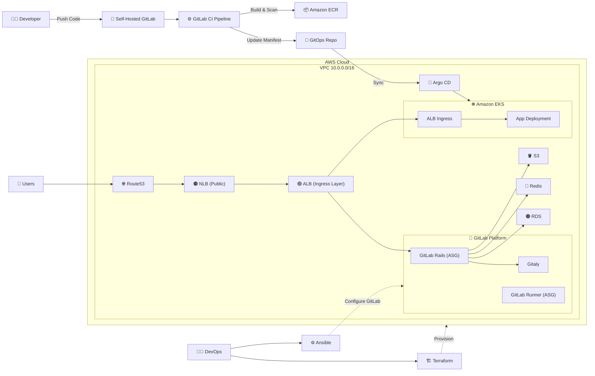

```mermaid
graph LR

%% =========================
%% Developer + CI/CD
%% =========================
Developer["👨‍💻 Developer"]
GitLab["🦊 Self-Hosted GitLab"]
Pipeline["⚙️ GitLab CI Pipeline"]
ECR["📦 Amazon ECR"]
Manifest["📁 GitOps Repo"]
ArgoCD["🔀 Argo CD"]

Developer -->|Push Code| GitLab
GitLab --> Pipeline
Pipeline -->|Update Manifest| Manifest
Pipeline -->|Build & Scan| ECR
Manifest -->|Sync| ArgoCD


%% =========================
%% AWS Infrastructure
%% =========================
subgraph AWS["AWS Cloud"]

    subgraph VPC["VPC 10.0.0.0/16"]

        %% Entry Layer
        Route53["🌐 Route53"]
        NLB["🟠 NLB (Public)"]
        ALB["🟢 ALB (Ingress Layer)"]

        Route53 --> NLB
        NLB --> ALB

        %% GitLab Platform
        subgraph GitLabPlatform["🦊 GitLab Platform"]
            Rails["GitLab Rails (ASG)"]
            Gitaly["Gitaly"]
            Runner["GitLab Runner (ASG)"]
        end

        %% Data Layer
        RDS["🟠 RDS"]
        Redis["🔴 Redis"]
        S3["🪣 S3"]

        %% Kubernetes
        subgraph EKS["☸️ Amazon EKS"]
            App["App Deployment"]
            Ingress["ALB Ingress"]
        end

        %% Connections (simplified)
        ALB --> Rails
        Rails --> Gitaly
        Rails --> RDS
        Rails --> Redis
        Rails --> S3

        ArgoCD --> EKS
        Ingress --> App
        ALB --> Ingress

    end
end


%% =========================
%% Terraform / Ansible
%% =========================
DevOps["👨‍💻 DevOps"]
Terraform["🏗️ Terraform"]
Ansible["⚙️ Ansible"]

DevOps --> Terraform
DevOps --> Ansible

Terraform -.->|Provision| AWS
Ansible -.->|Configure GitLab| GitLabPlatform


%% =========================
%% Users
%% =========================
User["👥 Users"]
User --> Route53
```
