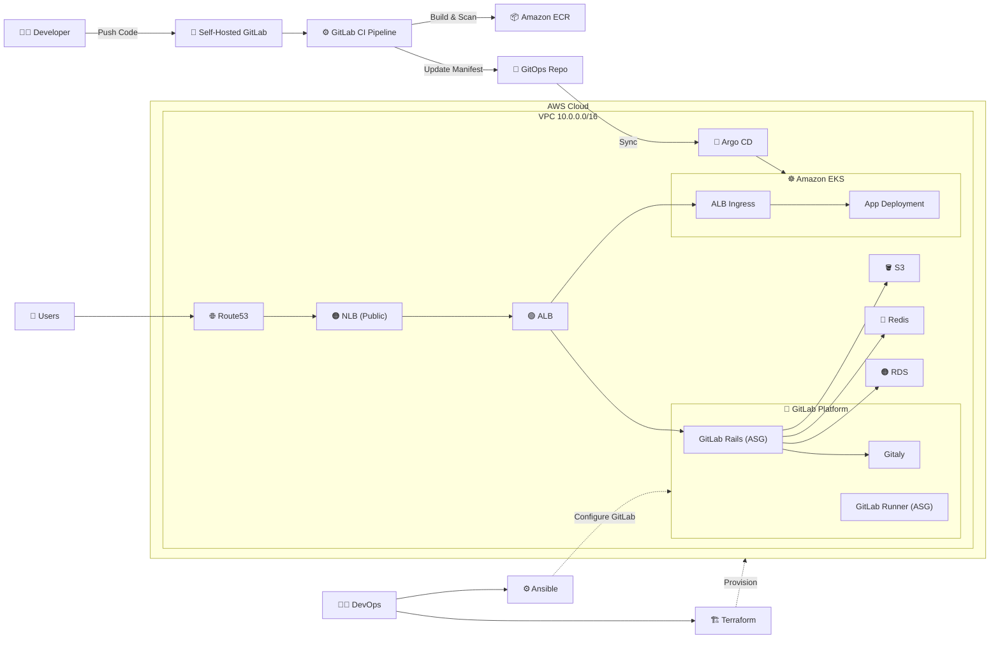

# 🚀 End-to-End DevOps Platform on AWS (Self-Hosted GitLab + GitOps + EKS)

## 📌 Overview

This project demonstrates a **production-style DevOps platform** built on AWS, featuring:

* Self-hosted GitLab (fully separated components)
* CI/CD pipelines with security scanning
* GitOps-based deployment using Argo CD
* Kubernetes workloads on Amazon EKS
* Infrastructure as Code using Terraform
* Configuration management using Ansible
* Preconfigured AMIs built with Packer

The system follows modern DevOps practices:

* **GitOps**
* **Infrastructure as Code**
* **Automated CI/CD**
* **Scalable cloud architecture**

---

## 🏗️ Architecture Diagram



---

## 🧩 Architecture Breakdown

### 👨‍💻 Developer Workflow

1. Developer pushes code to `gitlab.gnaig.click`
2. GitLab triggers CI/CD pipeline
3. Pipeline builds, tests, and scans the application
4. Docker image is pushed to Amazon ECR
5. Kubernetes manifests are updated
6. Argo CD syncs changes to EKS automatically

---

## 🔁 CI/CD Pipeline

The GitLab CI pipeline includes the following stages:

```text
Test → Lint & SAST → Build Docker Image → Image Scan → Push to ECR → Update GitOps Repo
```

### 🔍 Key Features

* **Automated Testing** – ensures code quality
* **Static Analysis (SAST)** – detects vulnerabilities early
* **Container Image Scanning** – security validation before deployment
* **GitOps Integration** – updates manifests instead of direct deploy

---

## 🦊 Self-Hosted GitLab Architecture

GitLab is deployed on AWS with separated components:

* **GitLab Rails (ASG)** – main application layer
* **Gitaly** – Git repository storage
* **GitLab Runner (ASG)** – executes CI jobs (isolated from app)

### 📦 Supporting Services

* **Amazon RDS (PostgreSQL)** – database
* **Amazon ElastiCache (Redis)** – caching
* **Amazon S3** – object storage

### 🌐 Networking

* **Route53** → DNS (`gitlab.gnaig.click`)
* **Public NLB** → handles HTTPS + SSH
* **Internal ALB** → routes traffic to GitLab Rails

---

## ☸️ Kubernetes Platform (Amazon EKS)

The application is deployed on **Amazon EKS** using GitOps.

### 🔧 Components

* **AWS Load Balancer Controller** – manages ALB ingress
* **ExternalDNS** – manages Route53 records automatically
* **Argo CD** – continuous delivery via GitOps

### 📦 Application Resources

* Deployment
* Service
* Namespace
* Ingress (ALB-based)

### 🌍 Domains

* `argocd.gnaig.click`
* `app.gnaig.click`

---

## 🔀 GitOps Workflow (Argo CD)

1. CI pipeline updates Kubernetes manifests
2. Argo CD detects changes in Git repository
3. Argo CD syncs state to EKS cluster
4. Application is deployed automatically

> No direct `kubectl apply` is used

---

## 🏗️ Infrastructure as Code (Terraform)

Terraform provisions:

* VPC, subnets, networking
* EKS cluster
* EC2 instances for GitLab components
* Load balancers (NLB + ALB)
* RDS, ElastiCache, S3
* IAM roles and permissions

### 🔐 Remote State

* **S3** – stores `terraform.tfstate`
* **DynamoDB** – state locking

---

## ⚙️ Configuration Management (Ansible)

Ansible is used to configure GitLab components:

* GitLab Rails setup (`/etc/gitlab/gitlab.rb`)
* `gitlab-ctl reconfigure`
* Gitaly configuration
* Rails ↔ Gitaly connectivity

---

## 📦 AMI Strategy (Packer)

Custom AMIs are created for:

* GitLab Rails
* Gitaly
* GitLab Runner

### ⚠️ Note

These AMIs are **preconfigured for faster provisioning**, but not fully immutable.

* Configuration updates are still applied using Ansible
* AMIs reduce setup time and improve consistency

---

## 🔐 Security Considerations

* CI pipeline includes **SAST and image scanning**
* Separation of GitLab components reduces blast radius
* Private subnets for internal services
* IAM roles for service-level access control

---

## 🚀 Future Improvements

* Introduce **monitoring (Prometheus + Grafana)**
* Add **centralized logging (ELK / CloudWatch)**
* Improve **secrets management (AWS Secrets Manager)**
* Implement fully **immutable infrastructure**

---

## 📬 Conclusion

This project showcases a **complete DevOps lifecycle**, from code commit to production deployment, using modern cloud-native tools and practices.

It reflects real-world architecture patterns used in production environments.

---
